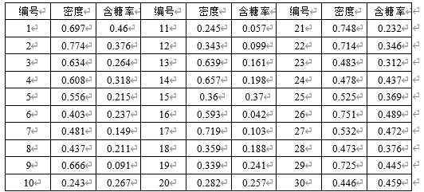

# 程序设计题
## 已知xigua4.0.csv文件内容如下，写python程序满足要求。


1. 使用pandas读取密度、含糖率、好瓜三列，使用sklearn切分为训练集和测试集，以xy作为最终返回值
```python
xigua30 = pd.read_csv('xigua4.0.csv', index_col=0)
xigua30_x=xigua30[["密度","含糖率"]].values
xigua30_y=xigua30[["好瓜"]].values.flatten()
xy = sklearn.model_selection.train_test_split(xigua30_x,xigua30_y)
```


2. 使用逻辑回归训练并在训练集和测试集计算准确度，分别输出在训练集和测试集上的准确度分数。
要求选择两种参数的模型，一种为默认参数；
一种设置最多迭代次数10000次。

```python
model = LogisticRegression()
model.fit(xy[0],xy[2])
print(model.score(xy[0],xy[2]),model.score(xy[1],xy[3]))
model = LogisticRegression(max_iter=10000)
model.fit(xy[0],xy[2])
print(model.score(xy[0],xy[2]),model.score(xy[1],xy[3]))
```


3. 使用高斯混合聚类在训练集的特征聚类为5类，并使用matplotlib画出聚类结果
```python
model = sklearn.mixture.GaussianMixture(n_components=5)
model.fit(xy[0])
x_predict = model.predict(xy[0])
input = np.array(xy[0])
plt.scatter(input[:, 0], input[:, 1], 
c=x_predict, cmap='cool')
plt.show()
```
