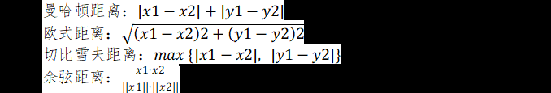

# 线性模型
## 什么是线性回归？它最常用的性能度量是什么，写出这种度量数学形式
答案：
1. 线性回归是使用一条直线拟合数据集数据分布的回归模型。
2. 常用的性能度量是MSE。
3. MSE的数学形式为  

## 简述线性分类与逻辑回归的联系和区别。
答案：
1. 线性分类和逻辑回归都是线性模型，且均用于分类任务。
2. 线性分类的分类面是一条直线。
3. 逻辑回归属于广义线性模型的一种，分类面是一条曲线。

## 梯度下降法一定会找到全局最优解吗？如果是，请说明原因；如果不是，请说明该问题和什么有关，以及应该如何解决这个问题。
答案：不一定;因为跟权值的初始值有关，会陷入局部最小值，可以通过随机初值、随机梯度下降、模拟退火、遗传算法等解决。

## 请简述机器学习模型常用的距离公式。
答案：

## 请简述线性判别分析LDA的算法步骤。
答案：
1. 数据准备：将数据集分为训练集和测试集。
2. 计算类内散度矩阵和类间散度矩阵：类内散度矩阵是指同一类别的样本之间的散度矩阵，而类间散度矩阵是指不同类别之间的散度矩阵。
3. 计算投影向量：投影向量是指将原始数据映射到低维空间中的向量，可以通过计算类内散度矩阵和类间散度矩阵的特征向量来得到。
4. 训练模型：使用数值优化算法对LDA的投影优化目标进行优化训练。
5. 模型评估：根据预测结果计算出准确率等指标进行评估。