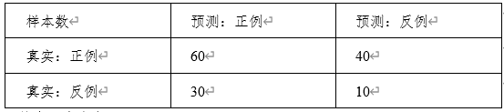

## 测试集和验证集的区别是什么？
答案：
1.	测试集是在测试阶段时使用。
2.	验证集是在训练阶段时使用。
3.	测试集用于评估模型性能。
4.	验证集主要用于确定参数的大小。
## 什么是留出法，用留出法划分训练集与测试集的优点和缺点是什么？
答案：
1)	留出法：数据集划分为两个互斥的集合，一个训练集，一个测试集。
2)	优点：简单。
3)	缺点：评估结果不够稳定。
## 请简述什么是K折交叉验证，并与留出法进行对比。
答案：
1)	K折交叉验证：将数据划分为K个大小相等的互斥子集，用其中的K-1个子集作为训练集，余下的那个子集作为测试集；进行K次训练和测试，使用K次结果的均值作为最终的结果。
2)	和留一法相比，K折交叉能够最终结果能够尽可能和训练数据的选取方式无关，比留出法的结果更能代表算法的实际性能。
3)	但是K折交叉计算需要更多资源，训练速度较慢。
## 什么是过拟合？如何克服过拟合？
答案：
1)	过拟合是指在训练集上误差很小，在测试集上误差很大的一种现象。
2)	避免方法1：增加训练集数据量。
3)	避免方法2：增加样本维度。
4)	避免方法3：早停法/减少训练轮次。
5)	避免方法4：加入人工干预。
6)	避免方法5：加入正则或DropOut。
## 什么是ROC曲线，它有什么作用？
答案：
1)	以真正例率为纵轴，假正例率横轴的测试数据变化曲线。
2)	ROC曲线可以用于研究学习器泛化功能。
## 请简述ROC和AUC的含义和作用？
答案：
1)	ROC曲线以真正例率为纵坐标，假正例率为横坐标，在二维平面绘制而成的一个曲线。
2)	AUC是ROC曲线下的面积，AUC越大，说明模型的泛化性能越好。
## 什么是查全率与查准率，二者有何区别？
答案：
1)	查全率：R=TP/(TP+FN) 查准率：P=TP/(TP+FP)
2)	查全率：用户感兴趣的有多少被检索
3)	查准率：检索有多少是用户感兴趣的。
## 计算下面混淆矩阵的查全率、查准率和F1
（请写出计算公式，结果可以用分数表示）

答案：查全率R=60/(60+40)=3/5
- 查准率P=60/(60+30)=2/3
- F1=(2*3/5*2/3)/(3/5+2/3)=12/19
## 计算下面混淆矩阵的TPR和FPR
（请写出计算公式，结果可以用分数表示）

答案：
- TPR=60/(60+40)=3/5
- FPR=30/(30+10)=3/4
## 请简述常见的模型评价方法。
答案：
1)	准确率（Accuracy）：准确率是指模型预测正确的样本数占总样本数的比例。准确率越高，说明模型的预测能力越好。
2)	查全率（Recall）：查全率是指模型正确预测为正的样本数占所有真实正样本数的比例召回率越高，反映了模型发现正例的能力。
3)	查准率（Precision）：查准率是指模型正确预测为正的样本数占所有预测为正样本数的比例。反映了模型的预测能力。
4)	F1-score：F1-score是精确率和召回率的调和平均数。F1-score越高，说明模型的综合表现越好。
5)	ROC曲线和AUC值：ROC曲线是反映模型真阳性率与假阳性率之间关系的曲线，AUC值是ROC曲线下面积。AUC值越大，说明模型的性能越好。
6)	混淆矩阵：混淆矩阵是将预测结果与真实结果进行比较的矩阵。通过混淆矩阵可以计算出准确率、召回率、精确率等指标。
7)	均方误差：预测值与真实值之间的差值的平方的平均值，反映了模型的精度和偏差。