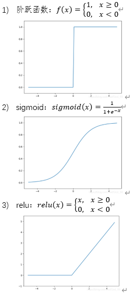

# 神经网络
## 请简要叙述逻辑回归和MLP模型之间的区别和联系。
答案：
1. 逻辑回归模型可以看做MLP中的一层，当MLP的激活函数使用sigmoid的时候，就和逻辑回归一样。
2. 从表达能力上说，神经网络比逻辑回归模型表达能力更强，或者说模型结构更复杂。
## 神经网络模型克服过拟合用到的方法有哪些？
答案：
1)	早停：从训练集中划分出验证集，在训练过程中，验证集如果误差开始升高，则终止训练。
2)	正则化：将模型的复杂性作为惩罚项加入计算误差，避免模型训练得过于复杂，常见的有L1正则和L2正则。
3)	dropout：在训练过程中随机遮挡一些节点，使每次训练时网络形式都不一样。
## 请列举至少5种神经网络的典型结构。
答案：
1)	多层神经网络MLP
2)	卷积神经网络CNN
3)	循环神经网络RNN
4)	RBF网络
5)	ART网络
6)	SOM网络
7)	级联相关网络
8)	Elman网络
9)	Hopfield网络
10)	Boltzmann机
## 请写出阶跃函数、sigmoid、relu三种激活函数的定义式及图形，并进行对比。
答案：

4)	对比：阶跃函数是最理想的激活函数，但难以用于训练。sigmoid函数可以看做导数连续的类阶跃函数，但导数中有指数项速度较慢。relu函数导数最简单，训练速度最快。
## 学习率的取值对神经网络训练有什么影响？
答案：
1)	过小的学习率: 训练收敛缓慢, 容易陷入局部最小值。
2)	过大的学习率: 可能导致训练不稳定, 振荡或无法收敛。
3)	合适的学习率：有助于快速且稳定地找到全局最小值。
