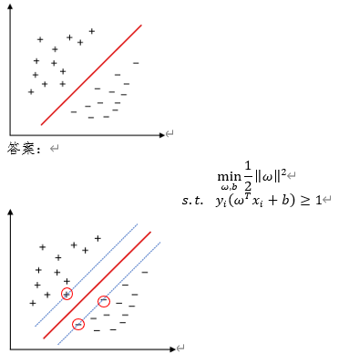
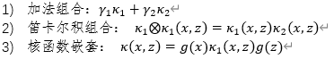

# 支持向量机
## 请简述逻辑回归和支持向量机的区别和联系。
答案：
1. 逻辑回归能够得到分类超平面，支持向量机能够得到最中间的超平面。
2. 逻辑回归引入了非线性的sigmoid函数，支持向量机能够使用核函数做非线性变换再计算。
## 请写出支持向量机的基本型，并在下图中画出按照基本型生成的分类边界的上下界，并圈出上下界中距离分类边界最近的所有点。

## 支持向量机的核函数有哪些？一般哪种性能更好，哪种速度更快？
答案：
1. 常用核函数：线性核、多项式核、高斯核、拉普拉斯核、sigmoid核。
2. 一般来说高斯核性能更好，线性核速度更快。

## 支持向量机的核函数组合形式有哪些？
答案：

## 支持向量机的有哪几种不同的实现方式？
答案：
1. 线性可分支持向量机：训练数据线性可分，通过硬间隔最大化，训练得到线性分类器。
2. 线性支持向量机：训练数据近似线性可分，通过软间隔最大化，也可以学习得到线性分类器。
3. 线性不可分支持向量机：训练数据线性不可分，通过核技巧 + 软间隔最大化，学习非线性支持向量机。